# 컴퓨터 구조 과제

## 1. **구름 IDE로 리눅스 개발환경 만들기**
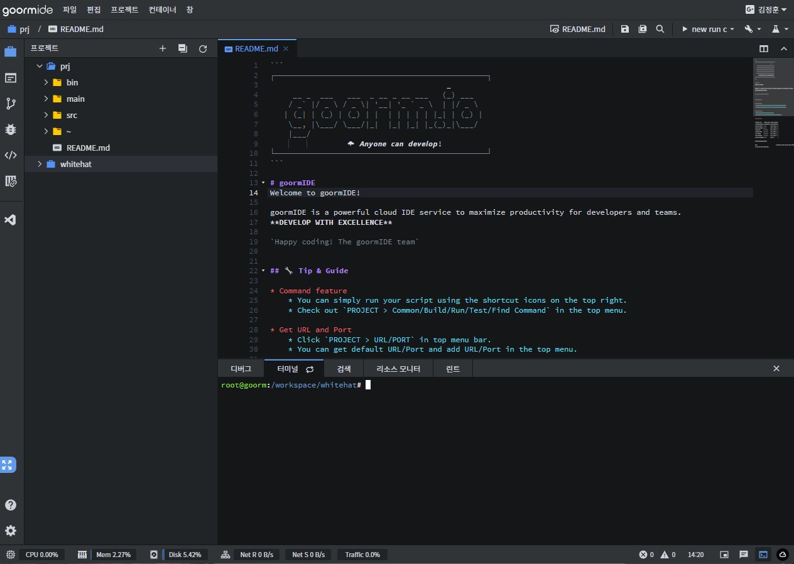

 

## 2. **Sizeof 연산 타이핑 해보기**
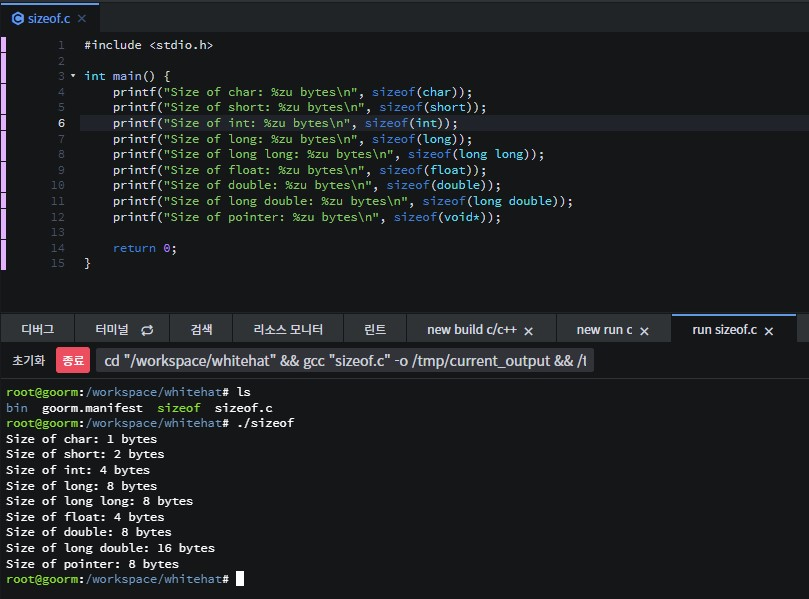

 

## 3. **오버플로 예제를 언더플로로 바꿔 해보기 - CHAR_MIN의 값에서 -1**
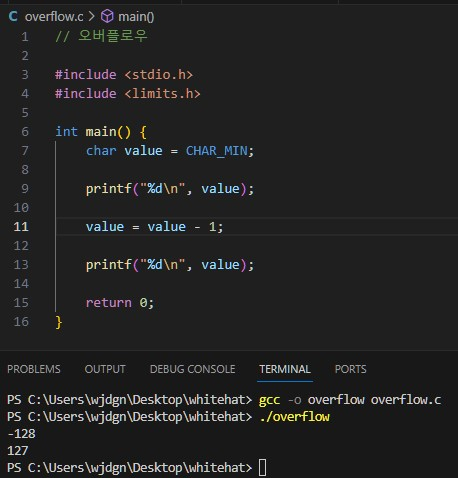

 

## 4. **비트 연산 프로그램 바꿔보기**
   - 특정 위치의 비트를 끄는 함수 구현
   - 사용자의 입력(특정 위치 -int값)을 받도록 수정

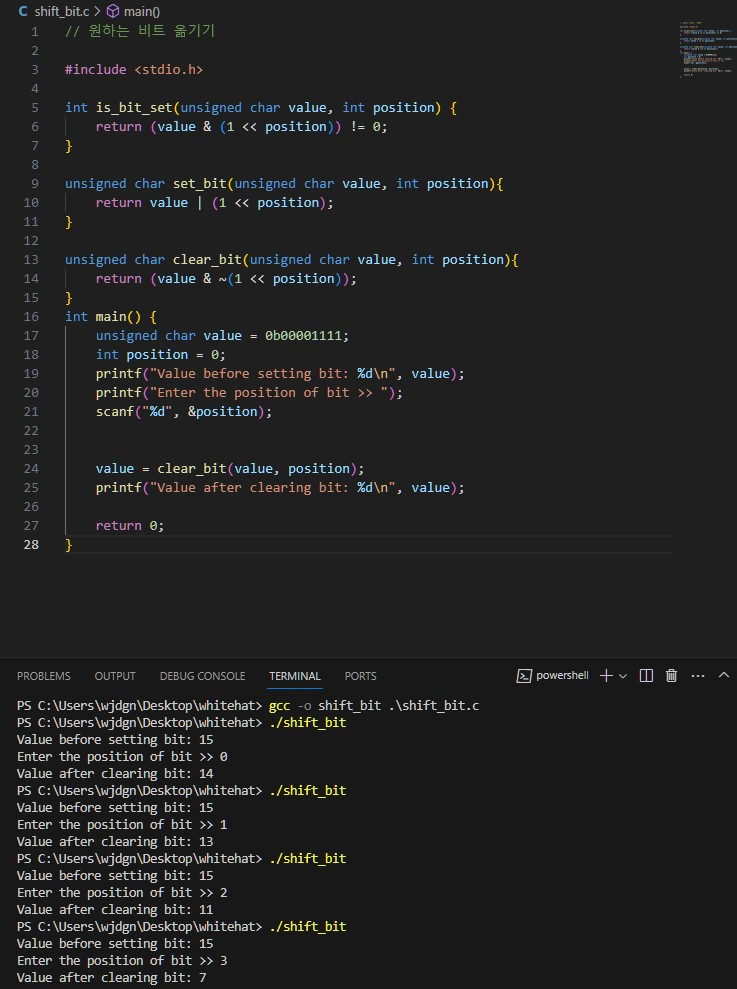

 

## 5. **C언어가 기계어가 되는 과정 직접 해보기**

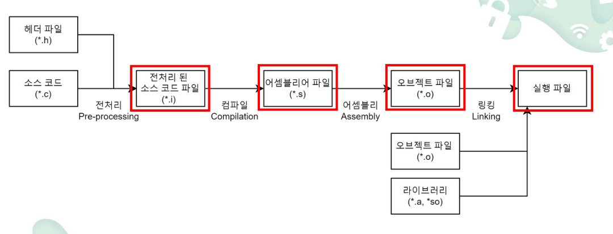

### **hello.c 파일**

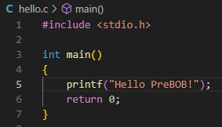

### **전처리 된 소스코드인 hello.i 파일**

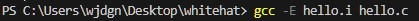

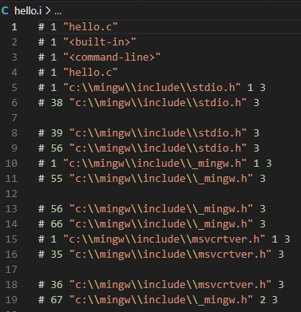
### **어셈블리어 파일인 hello.s 파일.**

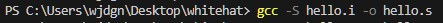

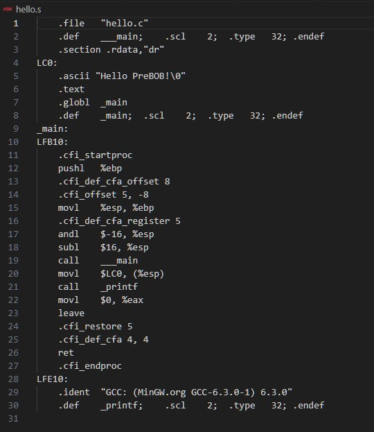
### **기계어 파일인 hello.o 파일**

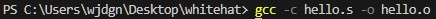

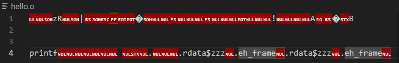

기계어 파일은 자체로 읽을 수 없으므로 전용 툴을 이용해야 한다.

나는 HxD를 이용해서 파일을 열어보았다. 

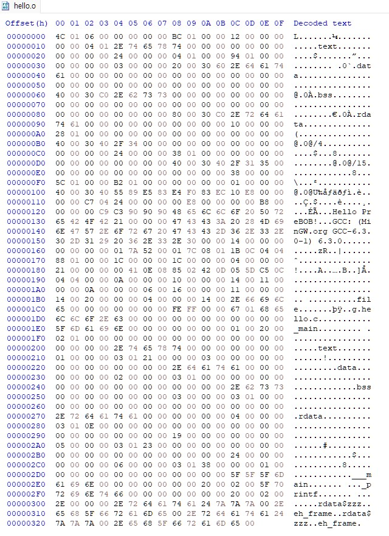

hello.o 파일을 확인할 수 있었다.