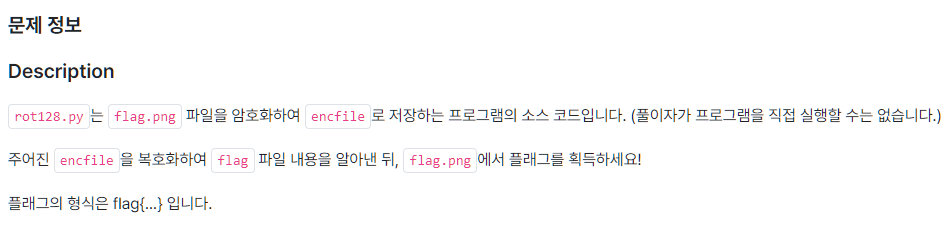
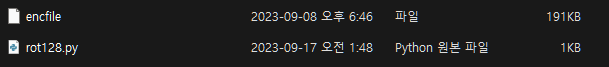
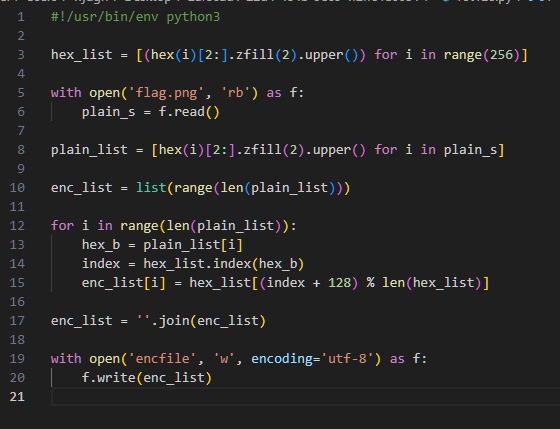
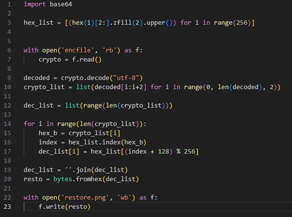
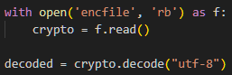
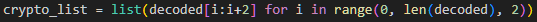
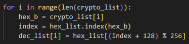
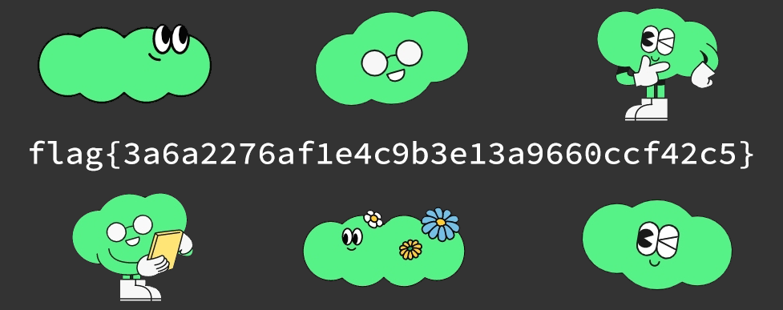

# ROT128
## 1. 문제

주어진 enfile을 복호화해서 flag파일 내용을 알아내는 문제이다.

 

## 2. 문제 분석

이렇게 두개의 파일이 있다. 

먼저 python파일을 열어보자

코드를 살펴보자

**hex_list**에 256까지 16진수 수를 생성해서 앞의 두자리(0x)는 없애고 앞에 0을 추가해 리스트로 만든다.  ------>  ['00', '01', '02', ...'FF']

**plain_s**는 정답이 들어있을 것 같은 flag.png파일을 바이너리로 읽어들였다. ------> "\x29\x45\x85..."

**plain_list**에는 plain_s를 hex_list같이 16진수 리스트로 저장한다. -------> ["29", "45", "85"...]

**enc_list**는 plain_list의 길이만큼 숫자를 생성한 리스트이다. --------> [0, 1, 2, 3, ...]

그리고 중요한 반복문. 

**enc_list**에 원래 **plain_list**의 HEX값에 128을 더하고 len(hex_list)인 256으로 나눈 나머지 값을 갖게한다.

그거를 utf-8로 인코딩해서 encfile로 저장한 것이다.

## 3. 문제 풀이
우리는 저걸 거꾸로 하면 될 것 같다.

먼저 enfile을 읽어서 'utf-8'로 디코딩 해준다.
  

그리고 다시 2글자 단위로 잘라서 crypto_list에 list로 만들어주었다.
  

 

그 다음 위의 반복문에서 했던 짓을 한 번 더 해준다. 

그러면 원래대로 돌아온다(256에서 128을 더한 나머지니까 128을 다시 더하면 원래대로 돌아옴)

그리고 원래대로 되돌린 HEX값들을 다시 바이너리로 써줘야 한다.

몰랐는데 bytes.fromhex()라는 편리한 함수가 있었다.

내용을 거꾸로 png파일에 작성해주면 된다.

다음은 복원한 png파일이다. flag가 나왔다.